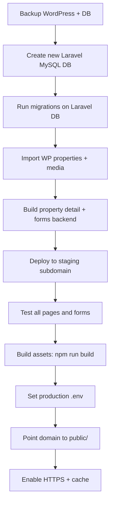

# Yes2Broker — Go-Live & Deployment Guide

> **Stack:** Laravel 12 · PHP 8.2 · MySQL · Blade · Tailwind CSS  
> **Local URL:** `http://localhost/yes2broker/public`  
> **Production:** [yes2broker.in](https://yes2broker.in/)  
> **Related docs:** [SITE-AUDIT.md](SITE-AUDIT.md) · [ROADMAP.md](ROADMAP.md)

---

## Overview

This guide explains how to move the Laravel application from local development to production, replacing the live WordPress site on **yes2broker.in**.

The site was originally built on WordPress with a live MySQL database. The Laravel project is a **rebuild**, not a drop-in replacement — it needs its own database schema and a data migration step before cutover.

---

## Current Project Status

| Area | Status |
|------|--------|
| Frontend pages (Home, About, All Properties, Contact, List Property, Channel Partner, Home Loan) | ✅ Done |
| Consultation popup (INQUIRE NOW) | ✅ Done (UI only) |
| Property detail `/property/{slug}` | ❌ Placeholder |
| Forms (contact, consultation, list property, etc.) | ❌ UI only — nothing saves to DB |
| Properties data | ❌ Static PHP files — not from live DB |
| Laravel database | ❌ Only default tables (users, cache, jobs) |
| Images | ⚠️ Hotlinked from live WordPress CDN |

**Bottom line:** The frontend is roughly 90% ready. The backend and data layer are not. Do not replace the live WordPress site until Phase 1 (database + import) and critical features are complete.

---

## Important: WordPress DB vs Laravel DB

You **cannot** point Laravel at the existing WordPress MySQL database and expect it to work.

| WordPress | Laravel |
|-----------|---------|
| `wp_posts`, `wp_postmeta`, `wp_terms` | Custom tables: `properties`, `leads`, etc. |
| Post type `properties-details` | Eloquent `Property` model |
| ACF / custom fields in meta | Normalized columns or JSON fields |

### What to do instead

1. **Backup** the WordPress database (keep it safe).
2. Create a **new** MySQL database for Laravel (e.g. `yes2broker_laravel`).
3. Run Laravel migrations on the new database.
4. **Import** WordPress data into Laravel tables via a migration script (see [ROADMAP.md](ROADMAP.md) Phase 1).

**Never** run `php artisan migrate` against the live WordPress database — it can corrupt WordPress tables.

---

## Deployment Options

### Option A — Staging first (recommended)

1. Keep WordPress live on `yes2broker.in`.
2. Deploy Laravel on a subdomain (e.g. `staging.yes2broker.in` or `new.yes2broker.in`).
3. Finish data migration, property detail page, and form backends.
4. Test thoroughly.
5. Switch the main domain to Laravel when ready.

### Option B — Direct cutover (higher risk)

Replace WordPress on the same domain in one step. Only use this after migration and full testing on staging.

---

## Pre-Launch Requirements

Complete these before replacing the live site.

### 1. Export from WordPress

From the live WordPress server:

- [ ] Full **MySQL dump** (`.sql` backup)
- [ ] Folder **`wp-content/uploads/`** (property images, logos, media)
- [ ] Note property post type: `properties-details` (~290 properties)
- [ ] List of active plugins (especially property-related plugins)

### 2. Build Laravel database (Phase 1)

Create migrations and models for:

- `properties`, `property_images`
- `leads` (consultation, contact, list property, channel partner)
- `partners`, `testimonials`, `localities` (as needed)

Then build an import command to move WordPress data → Laravel tables.

### 3. Finish missing features

- [ ] Property detail page (`/property/{slug}`)
- [ ] Form backends (save to DB + send email)
- [ ] SEO 301 redirects for any changed URLs
- [ ] Admin panel (optional but recommended — Filament per roadmap)

### 4. Host images locally

Currently images load from the live WordPress URL via `config('site.media_url')`.

For production:

1. Copy `wp-content/uploads/` to `storage/app/public/uploads/`.
2. Run `php artisan storage:link`.
3. Update image URLs in the database to point to local/CDN paths.

---

## Production `.env` Configuration

Create `.env` on the server. **Never commit** this file to Git.

```env
APP_NAME=Yes2Broker
APP_ENV=production
APP_DEBUG=false
APP_URL=https://yes2broker.in

# New Laravel database — NOT the WordPress DB
DB_CONNECTION=mysql
DB_HOST=127.0.0.1
DB_PORT=3306
DB_DATABASE=yes2broker_laravel
DB_USERNAME=your_db_user
DB_PASSWORD=your_strong_password

SESSION_DRIVER=database
CACHE_STORE=database
QUEUE_CONNECTION=database

MAIL_MAILER=smtp
MAIL_HOST=your-smtp-host
MAIL_PORT=587
MAIL_USERNAME=contact@y2b.in
MAIL_PASSWORD=your_mail_password
MAIL_FROM_ADDRESS=contact@y2b.in
MAIL_FROM_NAME="Yes2Broker"
```

### One-time commands on the server

```bash
php artisan key:generate
php artisan migrate --force
php artisan storage:link
php artisan config:cache
php artisan route:cache
php artisan view:cache
npm run build
```

---

## Server Requirements

| Requirement | Minimum |
|-------------|---------|
| PHP | 8.2+ |
| Extensions | `mbstring`, `openssl`, `pdo_mysql`, `tokenizer`, `xml`, `ctype`, `json`, `bcmath`, `fileinfo`, `zip` |
| Database | MySQL 5.7+ or MariaDB |
| Composer | Latest stable |
| Node.js | For building assets (`npm run build`) before deploy |

### Document root

Apache or Nginx must point to the **`public`** folder:

```
/home/youruser/yes2broker/public  →  https://yes2broker.in
```

**Do not** point the domain at the project root (`yes2broker/`) — that exposes `.env` and other sensitive files.

### Folder permissions

These directories must be writable by the web server:

- `storage/`
- `bootstrap/cache/`

---

## URL Structure (WordPress → Laravel)

Laravel routes already mirror the WordPress URL structure:

| WordPress | Laravel route |
|-----------|---------------|
| `/` | `/` |
| `/about-us/` | `/about-us` |
| `/all-properties/` | `/all-properties` |
| `/property/{slug}/` | `/property/{slug}` |
| `/contact/` | `/contact` |
| `/list-your-property/` | `/list-your-property` |
| `/become-channel-partner/` | `/become-channel-partner` |
| `/home-loan/` | `/home-loan` |

Add 301 redirects in Laravel for any URLs that changed (trailing slashes, old plugin paths, etc.).

---

## Step-by-Step Deployment Checklist

| Step | Action |
|------|--------|
| 1 | Backup WordPress files + MySQL database |
| 2 | Create new Laravel database (e.g. `yes2broker_laravel`) |
| 3 | Upload project files (or deploy via Git) |
| 4 | Run `composer install --no-dev --optimize-autoloader` |
| 5 | Run `npm install && npm run build` (or commit `public/build/` from CI) |
| 6 | Configure production `.env` |
| 7 | Run `php artisan key:generate` |
| 8 | Run `php artisan migrate --force` |
| 9 | Import properties and related data from WordPress |
| 10 | Copy uploads to `storage/app/public` and run `storage:link` |
| 11 | Set permissions on `storage/` and `bootstrap/cache/` |
| 12 | Point domain document root to `public/` |
| 13 | Enable HTTPS (Let's Encrypt or hosting SSL) |
| 14 | Run `config:cache`, `route:cache`, `view:cache` |
| 15 | Test all pages, forms, and property detail on staging |
| 16 | Cut over main domain (or switch DNS) |
| 17 | Submit updated sitemap to Google Search Console |
| 18 | Keep WordPress backup for rollback (at least 30 days) |

---

## Deployment Flow



---

## Replacing WordPress on the Same Domain

When ready for cutover:

1. **Backup** everything (files + database).
2. Upload the Laravel project to the server.
3. Change document root to `yes2broker/public`.
4. Archive or remove old WordPress files (`wp-admin`, `wp-content`, `wp-includes`, root `index.php`, etc.).
5. Configure production `.env` and run artisan commands.
6. Verify HTTPS, forms, and property pages.
7. Monitor errors for 24–48 hours after launch.

### Rollback plan

If something goes wrong:

1. Restore WordPress files from backup.
2. Restore WordPress MySQL dump.
3. Point document root back to WordPress.
4. Fix issues on staging before trying again.

---

## What Works Today vs What Does Not

| Works now | Does not work yet |
|-----------|-------------------|
| All main page designs | Property detail page content |
| Property listing (290 static items) | Real-time data from your DB |
| EMI calculator | Form submissions saved |
| INQUIRE NOW popup UI | Admin to manage properties |
| Hotlinked images from WP | Local image hosting |

---

## Recommended Launch Order

1. **Phase 1** — MySQL schema + WordPress data import command
2. **Property detail page** — `/property/{slug}`
3. **Form backends** — leads table + email notifications
4. **Staging deploy** — test on `staging.yes2broker.in`
5. **Production cutover** — switch `yes2broker.in` on a low-traffic day

---

## FAQ

### Can I use the same live WordPress database?

No. Export data from WordPress and import it into **new** Laravel tables in a **separate** database.

### What do I change in `.env` for live?

Set `APP_ENV=production`, `APP_DEBUG=false`, `APP_URL=https://yes2broker.in`, production MySQL credentials, and SMTP mail settings.

### Is the project ready to go live today?

No. The frontend is largely complete, but forms, property detail, and database integration are not. Going live now would show a pretty site with no working lead capture and incomplete property pages.

### Do I need Node.js on the production server?

Only if you build assets on the server. You can also run `npm run build` locally or in CI and deploy the compiled `public/build/` folder.

### cPanel / shared hosting notes

- Set document root to `public_html/yes2broker/public` (or symlink).
- Create MySQL database and user in cPanel → MySQL Databases.
- Use cPanel **Terminal** or **Setup PHP App** if SSH is limited.
- Enable PHP 8.2 in **Select PHP Version**.
- Schedule `php artisan schedule:run` via cron if using queues or scheduled tasks.

### VPS notes

- Use Nginx or Apache with `public` as root.
- Use Supervisor for queue workers if `QUEUE_CONNECTION=database` or `redis`.
- Use Certbot for free SSL: `certbot --nginx -d yes2broker.in -d www.yes2broker.in`

---

## Next Development Steps

| Priority | Task | Doc reference |
|----------|------|---------------|
| 1 | Database schema + WordPress import | [ROADMAP.md](ROADMAP.md) Phase 1 |
| 2 | Property detail page | [ROADMAP.md](ROADMAP.md) Phase 2 |
| 3 | Form backends (leads + email) | [ROADMAP.md](ROADMAP.md) Phase 4 |
| 4 | Admin panel (Filament) | [ROADMAP.md](ROADMAP.md) Phase 5 |
| 5 | SEO redirects + sitemap | [ROADMAP.md](ROADMAP.md) Phase 7 |

---

*Last updated: June 2026*
